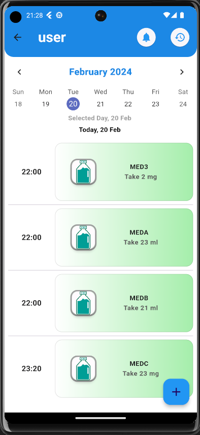
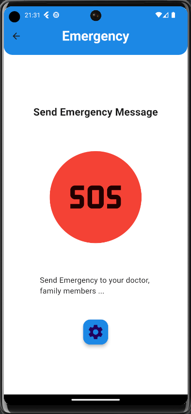

# Introduction

Eldafriend, A pal for the elder community!
Track your medication, along with reminders and many showstopper features that ensure completely homely care.


Dashboard            |  Medicine Tracker          |  SOS
:-------------------------:|:-------------------------:|:-------------------------:
  |   |  


# Features include:

  * **Interactive Interface:** An easy-to-use, self explainatory and interactive interface.

  * **Medicine Reminder/Tracker**: Set up medicine reminders and never miss a dose again! You can set medicine type, dosage in mg or ml, duration of medication track your medicine activity, and get timely reminder notifications.

  * **Report Analysis**: Get a view on the insights about medicine intakes activity.

  * **Elder Mode**: Pin-protected dual mode. The dual mode features ensure a separate simple and minimalistic User Interface, which makes it a lot easier for the elder generation to navigate and execute the most essential features of the app

  * **Communities**: Community Chat and Support feature where people can form groups and talk to each other, share their problems, and discuss among themselves. Community Chat Support with authorized admins who will not only share regular health facts and updates but also will ensure that it's a safe space to foster positive connections and ensure healthy mental well-being for the elders.

  * **Gemini AI**: Equipped with the latest AI bot, powered by Google Gemini API which will assist you with diet plans, food recipes, and whatnot

  * **Expense Tracker**: Log, edit or delete your expenses and get instant overview.

  * **SOS**: SOS feature that provides a live location to list specified contacts in times of emergency.


# Installation

Download the .apk from [release](https://github.com/Emir2099/Eldafriend/releases/tag/v1.0.0)


# Step-by-Step Guide to Use Eldafriend Flutter Mobile Application Source Code:

**Step 1: Prerequisites**
<br>
Ensure you have the following installed on your development machine:
- Flutter SDK: Visit Flutter Installation Guide for installation instructions.
- Dart SDK: Included with Flutter installation.
- Code Editor: Use Visual Studio Code

**Step 2: Clone the Repository**
<br>
Clone the Eldafriend repository from the GitHub link provided:
```bash
git clone https://github.com/Emir2099/Eldafriend.git
```

**Step 3: Install Dependencies**
<br>
```bash
flutter pub get
```

**Step 4: Run the Application**
<br>
Launch the Eldafriend app on an emulator or connected device:
```bash
flutter run
```